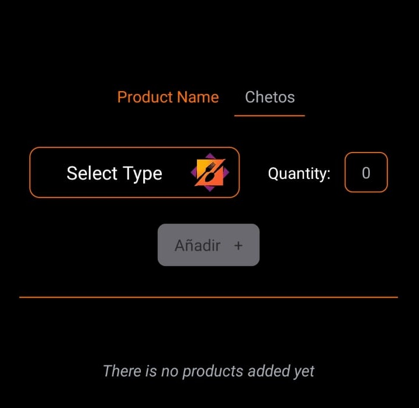
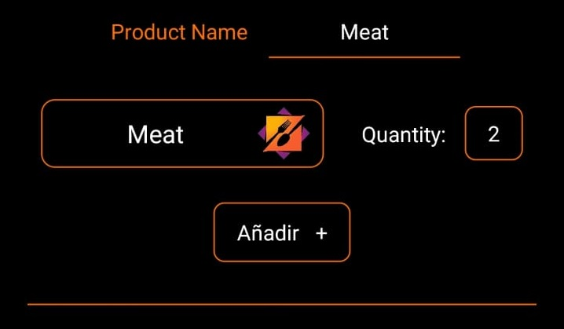
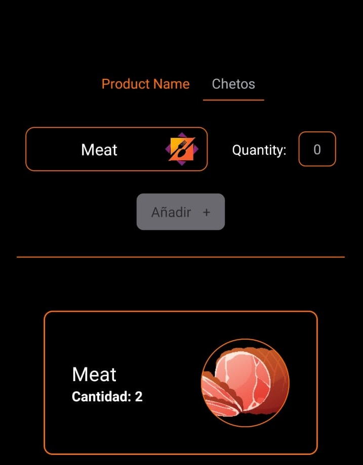

# Shopping List:

The next project, is a modest and simple project made for the 2º Grade Programing Cycle on Multiplatforms enviorement. In this case its made with **React Native Js**, the main idea was to do a Shopping List that
accomplished the nexts objectives:

1. It would have a top menu that would have a Name, Quantity, Button and Dropdown selector that would
   declare the item.
2. When an Item is added it will appear on the Bottom list (or a sentence that there is no elements added
   to the list) and if you double tap it you can remove it from it. **Sadly I didnt find the way of changing**
   **the appearence when you double tap, instead of removing the item**, the option is available as a CSS style
   but not implemented.

This will be the appareance in the cases that the list has elements on it, and when we are or not introducing or have already introduced something:

#

    

#

(The clear Button would be the same as the Add button since there is no products added). Then if we do select information it will look like this:

    

When we add a product it will be like this:
#

    

#

Hope you like it.